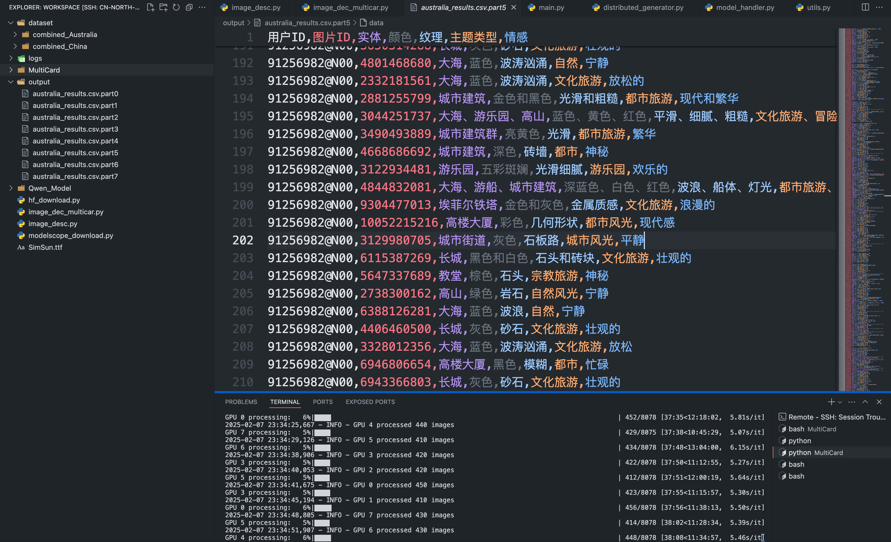
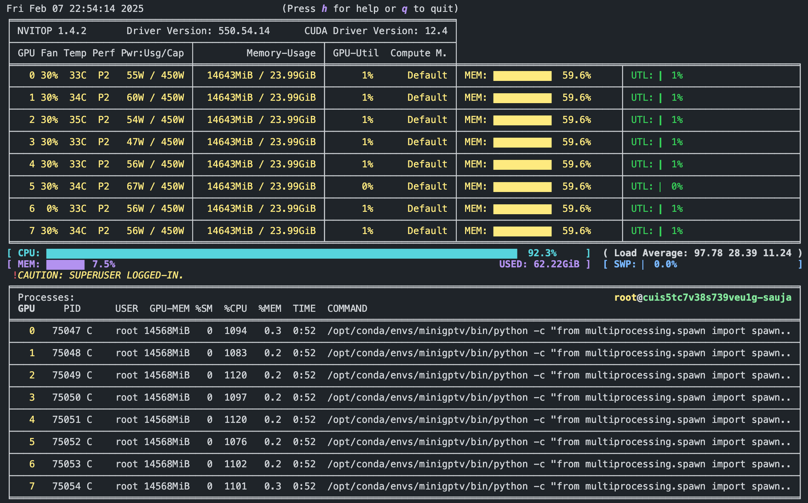
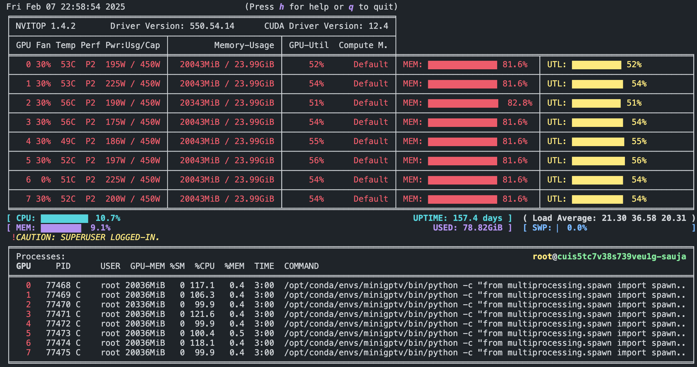
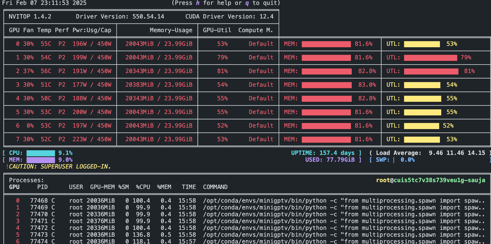

# Multi_Card_Infer DDP Based
RTX4090 x 8 

# Multi-GPU Image Understanding System 🖼️⚡

[](https://www.python.org/downloads/)
[](https://pytorch.org/get-started/locally/)
[](https://opensource.org/licenses/MIT)

基于分布式数据并行（DDP）的多GPU图像内容理解系统，使用Qwen-VL-Chat对图片进行分析，生成结构化描述数据。


## 主要特性 ✨

- 🚀 **多GPU分布式处理** - 自动检测可用GPU数量，实现线性加速
- 🔍 **细粒度图像分析** - 实体识别、颜色分析、纹理特征提取、主题分类、情感分析
- 📊 **结构化输出** - 生成标准CSV格式结果文件，便于后续分析
- 📈 **智能容错机制** - 自动重试、部分结果保存、错误隔离
- 📝 **详细日志系统** - 多进程独立日志记录，精确到GPU级别

## 快速开始 🚦

### 环境要求
- NVIDIA GPU (推荐RTX 4090)
- CUDA 11.7+
- Python 3.8+

### 安装步骤

```shell
git clone https://github.com/yourusername/multi-card-infer-ddp.git
cd multi-card-infer-ddp
```

安装依赖

```shell
pip install -r requirements.txt
```

准备Qwen-VL模型 (需自行获取)

```shell
mkdir -p /root/workspace/Qwen_Model/Qwen/
将模型文件放入 /root/workspace/Qwen_Model/Qwen/Qwen-VL-Chat 目录
```



 

 

 